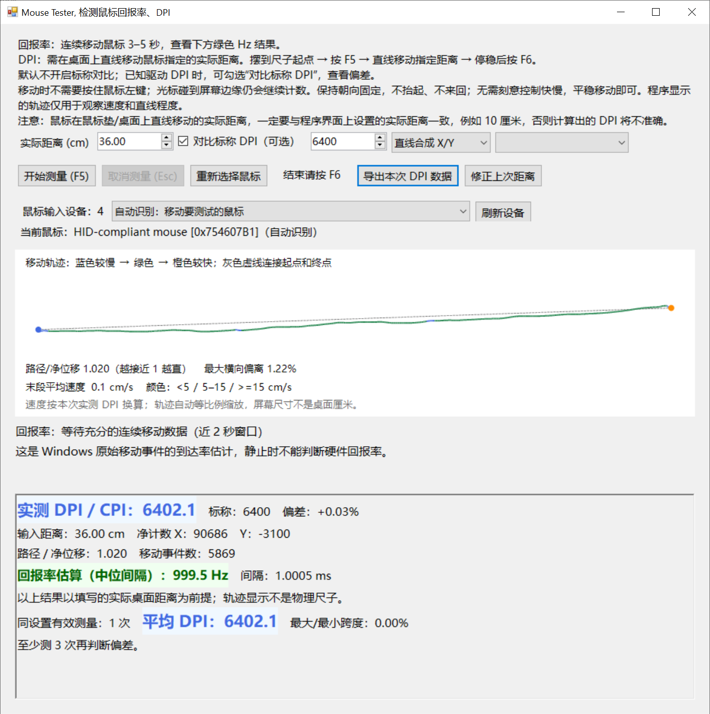
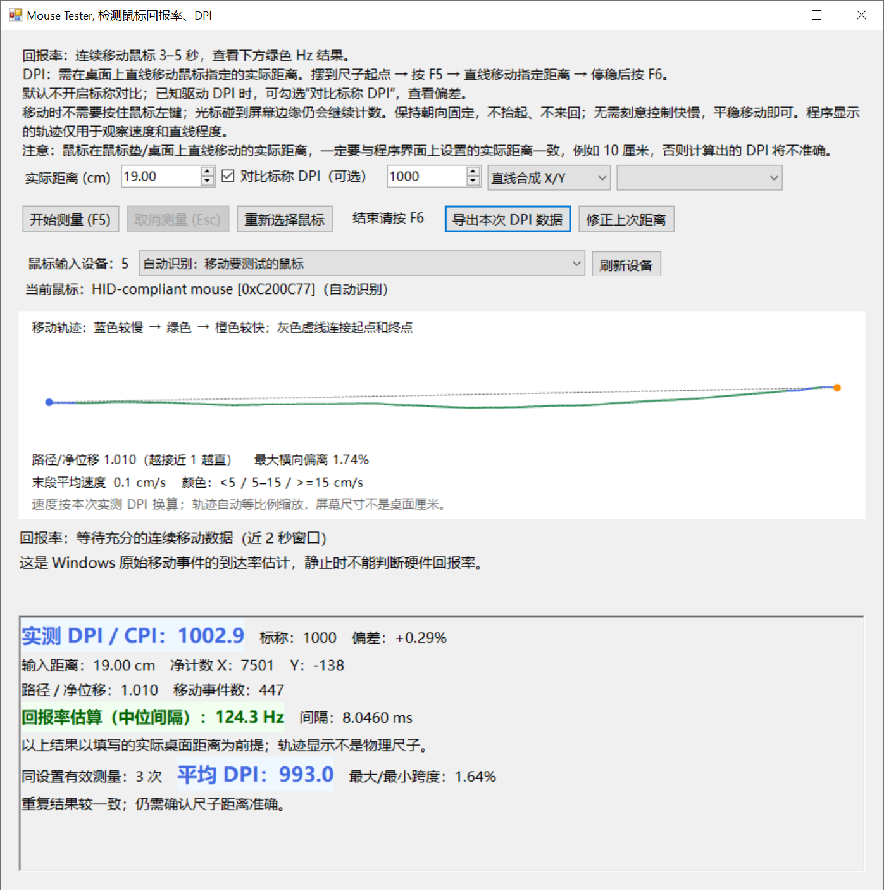

# Mouse DPI & Polling Rate — 鼠标回报率与 DPI 测试工具

**Windows 鼠标回报率测试、鼠标 DPI 测试、无线游戏鼠标 DPI 检查工具。** 基于 Windows Raw Input，实测有效 CPI/DPI，估算鼠标回报率（Polling Rate / Report Rate），支持有线鼠标、无线游戏鼠标。

基于 microe1/MouseTester 的 Raw Input 采集代码开发，重新实现中文测量界面、DPI 与回报率统计、轨迹显示及多鼠标支持。

本仓库为独立项目，保留原项目 MIT 许可与来源声明。仓库名：**MouseTester-DPI-PollingRate**；界面为中文，发布版本为单个 EXE。

[下载最新版本](https://github.com/JetsunWorks/MouseTester-DPI-PollingRate-new/releases/latest) · [详细使用说明](使用说明.md) · [原始项目](https://github.com/microe1/MouseTester)

## 界面与实测示例

截图由使用者实际测试提供：填写桌面移动距离 36cm，标称 DPI 6400，实测 DPI 6402.1，偏差约 +0.03%；该次回报率估算约 999.5Hz。截图只是一次测试示例，不代表所有鼠标的测试结果。

## 普通无线鼠标回报率

这张普通无线鼠标的实测截图显示 **124.3Hz**，中位间隔 **8.0460ms**，接近常见的 **125Hz** 档位。标称 DPI 为 1000，当前单次实测 DPI 为 1002.9；三次有效测量的平均 DPI 为 993.0。DPI 与回报率是两项不同指标：DPI 表示每英寸移动计数，回报率表示每秒报告次数。

普通办公无线鼠标常见回报率为 **125Hz**；游戏鼠标通常支持更高的回报率，常见 **1000Hz**，**2000、4000 或 8000Hz**。实际档位取决于鼠标型号、接收器、连接方式及驱动设置；并非所有无线鼠标都是 125Hz，也并非所有游戏鼠标都支持 8000Hz。蓝牙模式与专用 2.4GHz 接收器的回报率也不同。

| 回报率 | 理论报告间隔 |
| --- | --- |
| 125Hz | 8ms |
| 1000Hz | 1ms |
| 2000Hz | 0.5ms |
| 4000Hz | 0.25ms |
| 8000Hz | 0.125ms |

测试回报率时持续移动鼠标，读取绿色“回报率估算（中位间隔）”。软件测到的是 Windows Raw Input 移动事件间隔，受系统负载、事件积压和无线连接影响；尤其在高回报率档位，不能用一次软件读数代替硬件总线测量。静止后的“等待数据”不代表鼠标回报率降为零。

## 快速开始

1. 从 Releases 下载 EXE（或下载 ZIP 后解压），运行 `MouseTester-CPI.exe`。无需 OxyPlot DLL、config 文件或管理员权限；需要 .NET Framework 4.6 或更新的 4.x。
2. 有多个鼠标时，在设备列表选择待测鼠标；也可以保留自动识别，测试时只移动待测鼠标。
3. **测回报率：** 连续移动鼠标 3–5 秒，读取绿色 Hz 数值，无需填写 DPI 或按 F5。
4. **测 DPI：** 用直尺在鼠标垫/桌面上标记相距 10cm 的两个位置，在程序中填写实际距离 10cm。鼠标外壳同一位置对齐起点 → 按 F5 → 保持朝向沿直线移动到终点 → 停稳后按 F6。读取蓝色实测 DPI。
5. 需要对比驱动中的 6400 等 DPI 设置时，勾选“对比标称 DPI”并填写该值。未知 DPI 时不用填写，标称值不参与实测计算。

**必须让程序填写的距离与鼠标在桌面上实际移动的距离一致。屏幕光标移动距离不是桌面距离；光标碰到屏幕边缘也会继续记录。** 不需要按住左键，不抬起、不旋转、不来回；无需刻意控制快慢，平稳移动即可。F5 后等待再移动、停稳后等待再按 F6，不影响 DPI。

改变距离是在设置下一次测量，会清空旧平均统计并保留上次结果。如果上次距离填错，修改距离后点击“修正上次距离”。切换鼠标或改变驱动 DPI 档位后，重新选择鼠标再测。建议用相同设置重复 3–5 次，比较平均 DPI 和波动。

---

Windows 鼠标测试工具，基于 [microe1/MouseTester](https://github.com/microe1/MouseTester) 修改。当前版本 1.7.2，仅显示一个中文测量窗口。

不用预先知道鼠标的 DPI 或回报率：回报率直接移动即可测试；实测 DPI 只需要鼠标在桌面上移动的实际距离。标称 DPI 是可选对比项，不参与实测 DPI 计算。

## 安装与启动

单文件版本只需运行 MouseTester-CPI.exe。

需要.NET Framework 4.6 或更新版本的运行环境，无需管理员权限。

## 第一次使用：测试回报率

1. 打开程序，在设备列表选中待测鼠标；或保留自动识别，只移动待测鼠标。
2. 无需填写 DPI、无需按 F5，连续画圈或左右移动 3–5 秒。
3. 查看绿色加粗显示的 Hz 数值。停止移动后，实时窗口可能显示等待数据，这是正常现象。
4. 换鼠标时从列表选择；“重新选择鼠标”按钮回到自动识别模式。

结果为 Windows Raw Input 移动事件的到达率估计，不是 USB 总线轮询配置读取。
近 2 秒内数据不足或停止移动时，不能判断硬件回报率。

- 回报率估算（中位间隔）：1000 / 中位间隔(ms)，作为绿色主要结果。0.5ms 对应约 2000Hz。
- 连续段平均事件率：排除 >20ms 长间隔后的移动事件到达率，排除数量仍显示。
- 实时区域的全窗口平均事件率保留长间隔和停顿影响，可能明显低于硬件配置的回报率。
- 中位间隔：1000Hz 通常接近 1ms；500Hz 接近 2ms。
- P99：99% 的正间隔不超过该值。

系统调度、事件积压、无线连接、移动速度和负载均可能影响结果。不要把停止移动期间没有事件解释成硬件回报率降低。>20ms 是显示统计阈值，不是自动丢包判定。

## 多鼠标设备

显示 Windows Raw Input 鼠标输入设备数量、设备选择列表和当前设备名称。名称优先读取 Windows 提供的设备描述；无法读取具体型号时显示 HID 名称、VID/PID 和句柄。悬停设备选择框或当前鼠标名称可查看设备路径。

数量可能包含触摸板、虚拟设备或同一鼠标的多个接口，不一定等于实物鼠标数量。名称在后台读取，不阻塞测试；“刷新设备”可重新枚举，插拔会自动刷新。

- 手动模式：从列表选中设备，只接收它的移动；F5 不更换设备。
- 自动模式：实时回报率锁定首先移动的设备；每次 F5 后重新识别首先移动的设备。测量期间不要动其他鼠标。
- 测量期间锁定选择；选中设备断开会取消本次测量，防止混合设备结果。

两只鼠标名称相同时，先移动一只看“当前鼠标”，再从列表选择对应句柄。设备路径也可帮助区分。无法取得厂商型号时不要将通用 HID 名称当作准确产品型号。

## 测试 DPI：不知道当前 DPI 也能测

程序中设置的移动距离，比如10厘米，一定要与鼠标在鼠标垫/桌面上直线移动的实际距离一致，否则计算出的DPI结果将不准确。

1. 保持“对比标称 DPI（可选）”不勾选，不用填写 DPI。
2. 在鼠标垫旁放直尺，标记桌面起点和终点，在“实际距离”填写对应厘米数，默认 10cm。
3. 用鼠标外壳同一个位置（例如前沿）对准起点。先摆好鼠标，保持测量窗口在前台，按 F5 开始。
4. 保持鼠标朝向固定，沿直线单向平稳移动指定距离；无需刻意控制快慢，平稳移动即可。不要旋转、抬起或来回移动。
5. 到桌面终点停稳后按 F6，读取蓝色加粗的实测 DPI。按 F5 后等待再移动、到终点等待再按 F6，均不会影响 DPI；等待期间避免额外移动鼠标。DPI 按净计数和实际距离计算，不按时间计算。开始和结束无移动事件的等待也不计入主要回报率的移动事件间隔。
6. 重复 3–5 次，比较平均值和波动。Esc 或取消按钮会丢弃当前测量。
7. 上次实际距离填写有误时，修改距离后点击“修正上次距离”，用上次原始计数重新计算。只修改参数会用于下一次 F5 测量，保留上次结果并清空重复统计。

如果提示移动数据不足，查看具体原因和计数：记录时长、所有输入、当前设备有效移动、其他设备输入、绝对坐标/无设备标识、零位移。它表示当前设备在 F5–F6 期间只有 0–1 个有效移动事件，不是因为轨迹弯曲或 DPI 偏差过大。多鼠标时先明确选择设备，再摆好鼠标、F5 开始、移动、F6 结束。

这里的 10cm 是鼠标在桌面上的位移，不是屏幕光标移动距离。光标碰到屏幕边缘后，原始计数仍会继续记录。屏幕轨迹自动缩放，不是物理尺子。

没有直尺可用标准 A4 纸短边 21cm 或长边 29.7cm 作桌面参照，距离快捷选择框可填入对应值。必须保持鼠标朝向固定，以外壳同一位置对齐纸张两端，不能按纸上光标的位移判断。

实测 CPI = 净移动计数 × 2.54 / 实际距离(cm)。
例如实际移动 25.4cm（10 英寸）、净计数 60000，实测 CPI 为 6000。

软件不能凭空获知实际物理距离，也不能通用读取厂商固件 DPI 档位。本工具验证有效 CPI，不能判断传感器是否原生支持某档 DPI、是否存在插值。准确度依赖实际距离、朝向及轨迹。建议暂时关闭 Raw Accel、驱动加速及角度修正。

## 已知 DPI：可选对比

知道驱动中的标称 DPI 时，勾选“对比标称 DPI（可选）”，输入标称值，查看实测结果相对标称的百分比偏差。取消勾选后，直接显示实测值，不显示标称偏差。

填写或修改标称值不会改变实测 DPI。通过鼠标上的 DPI 按钮或驱动切换档位后，程序无法自动识别档位变化；若直接继续测量，不同档位会混入同一组平均。例如先测得 6400、切档后测得 3200，平均约为 4800，并不代表任何一个档位。切档后请先点击“重新选择鼠标”清空旧重复统计，多鼠标时再选回待测设备；从新档位的第一次测量重新统计。

## 轨迹、速度和质量提示

- 彩色实线是原始 X/Y 计数累计轨迹，灰色虚线连接起终点，帮助观察弯曲和回头。
- 路径/净位移越接近 1 越直；最大横向偏离是轨迹到起终点直线的最大垂直距离占净位移的百分比。
- 未知 DPI 时，测量中速度显示为计数/秒，颜色表示相对快慢；结束后按实测 DPI 换算 cm/s。
- 已知标称 DPI 时，测量中速度按标称估算，结束后仍按实测 DPI 换算。
- cm/s 颜色：蓝色 <5、绿色 5–15、橙色 >=15，仅显示速度，不代表合格/不合格。
- 路径/净位移 >1.05、横向偏离 >2% 等情况提示检查轨迹，不计入有效重复平均。这些是操作提示阈值，不是传感器合格标准。

程序无法验证实际尺子距离、抬起或旋转。结果波动大时，应先检查这些因素，再判断 DPI 偏差。

## 导出与重复测量

“导出本次 DPI 数据”保存结果摘要及原始计数 CSV，时间单位 ms。
再次按 F5 会替换上次捕获数据，必要时先导出。
同设置、同设备的有效测量显示平均 DPI 和最大/最小跨度。修改距离、标称对比、轴设置或切换设备会清空重复统计；修改参数不会把上次计数作为新测量混入平均。点击“修正上次距离”会重新计算上次结果，并将修正后的有效结果作为新一组统计的第一条。结果区保留主要 DPI、回报率和重复平均，轨迹用于观察速度和直线程度。

## 编译与测试

安装 .NET SDK 与 .NET Framework 4.x 后，在源码目录运行：

~~~powershell
powershell -File build.ps1
powershell -File build.ps1 -RunTests
powershell -File build.ps1 -SingleFile -RunTests
~~~

常规输出位于 portable；单文件输出位于 single-file。构建使用 SDK 内 Roslyn 编译器和系统 Framework 程序集，无需下载 NuGet 包。原窗口及绘图代码保留用于溯源，但不参与当前构建。
原 .csproj 保留；有 Framework 4.6 targeting pack 的 Visual Studio 环境也可构建。

验证包括多设备列表/名称/手动选择、每次 F5 自动识别、无输入/其他设备诊断、未知 DPI 模式、可选对比、F5/F6/Esc、设备隔离、实际距离修正、公式、速度/轨迹、结果高亮和仅一个可见窗口的启动/退出。自动测试使用模拟计数，不替代实际鼠标的物理校准。

## 来源和许可

原始仓库：[microe1/MouseTester](https://github.com/microe1/MouseTester)。
基础提交：3c747afa502b7543704d5cea4303ecc2741ec8c8。
保留原项目 MIT LICENSE 和原有源代码。此版本增加单窗口界面、直接测量模式、可选标称对比、轨迹显示、突出显示结果、导出和测试。

## English: Mouse DPI analyzer & polling rate tester

Windows mouse tester for effective DPI/CPI measurement and polling/report rate estimation, including wired mice and wireless gaming mice. Select the mouse, move continuously for 3–5 seconds to estimate polling rate, or enter a ruler-measured physical distance in centimeters, press F5, move straight without lifting or rotating, stop at the endpoint, and press F6 to measure DPI. Screen cursor travel is not the physical distance. The declared DPI is optional and only used for comparison.

Effective CPI = net raw counts × 2.54 / physical distance in cm. Polling rate is estimated from the median interval between Windows Raw Input movement events; it is not a direct USB bus measurement or a firmware setting reader. A single EXE requires .NET Framework 4.6 or newer 4.x and no OxyPlot DLLs.

适用检索主题：鼠标回报率、鼠标回报率测试、鼠标 DPI、鼠标 DPI 测试、无线游戏鼠标 DPI 检查、鼠标 CPI 校准、MouseTester、mouse polling rate tester、mouse DPI analyzer、wireless gaming mouse、Raw Input。
